## Landing Page

 

## Login

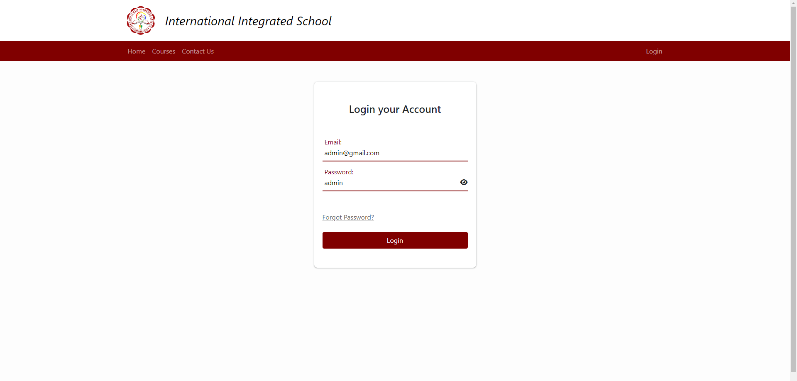

 

## Forgot Password

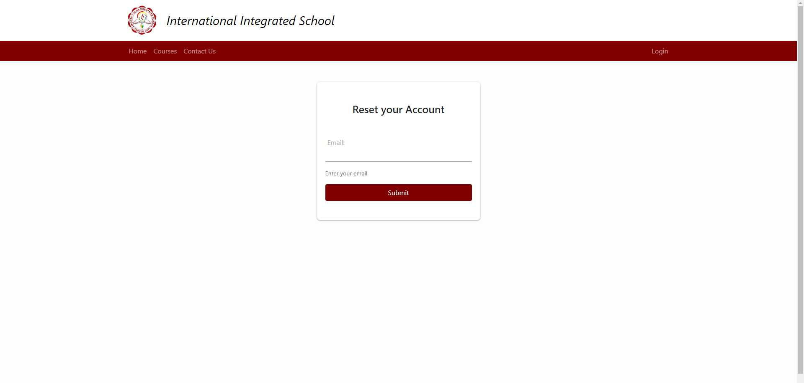

 

## Password Reset (for logged-in users)

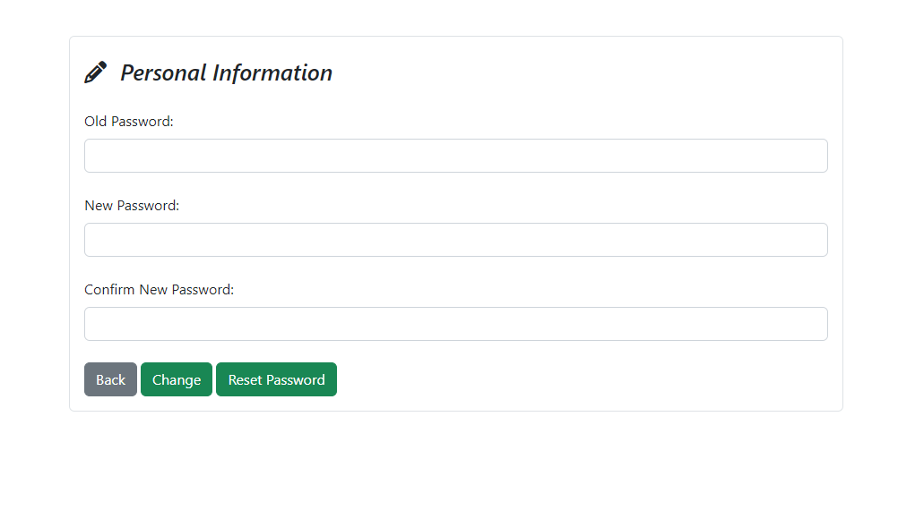

The **Password Reset** button will send a reset link to the user's email.

 

# Admin Interface

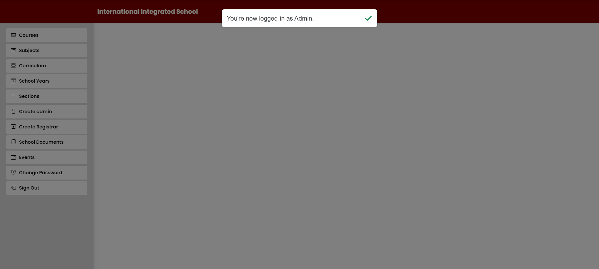

 

## Courses

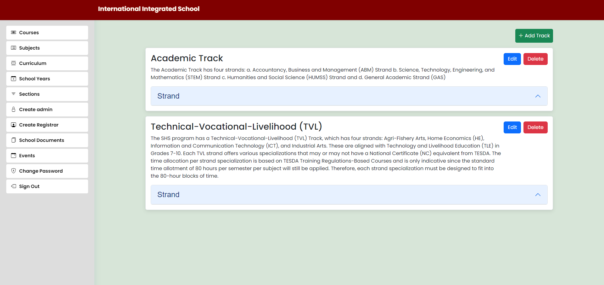

This page will display all available course of the school.

### Strands

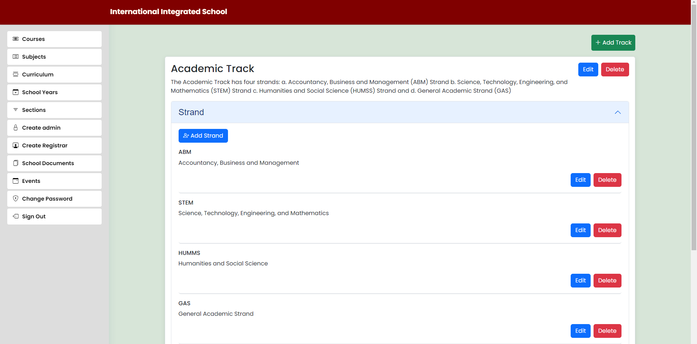

### Add Strand

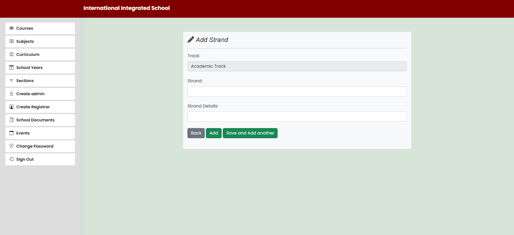

The form used to add a strand to a track.

### Add Track

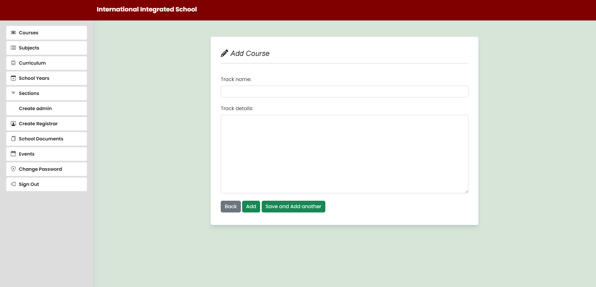

 

## Curriculum

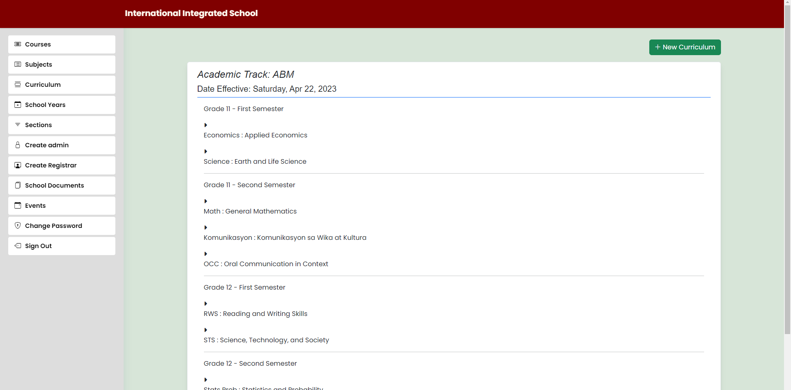

### Add Curriculum

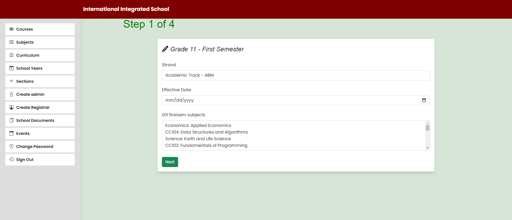

A multi-step form to add new curriculum.

 

## School Section

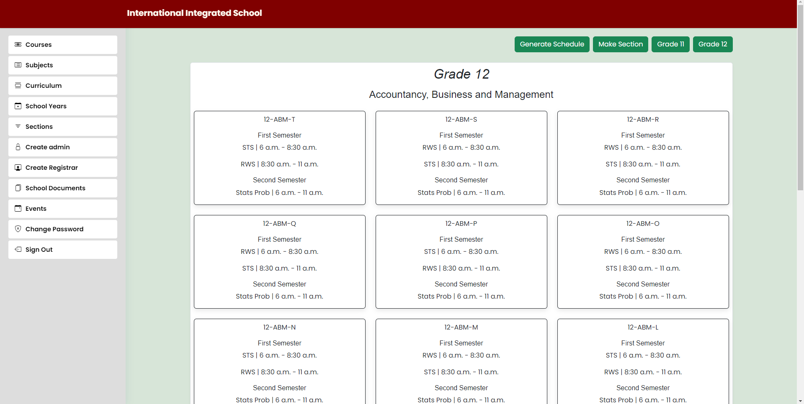

### Add New Section

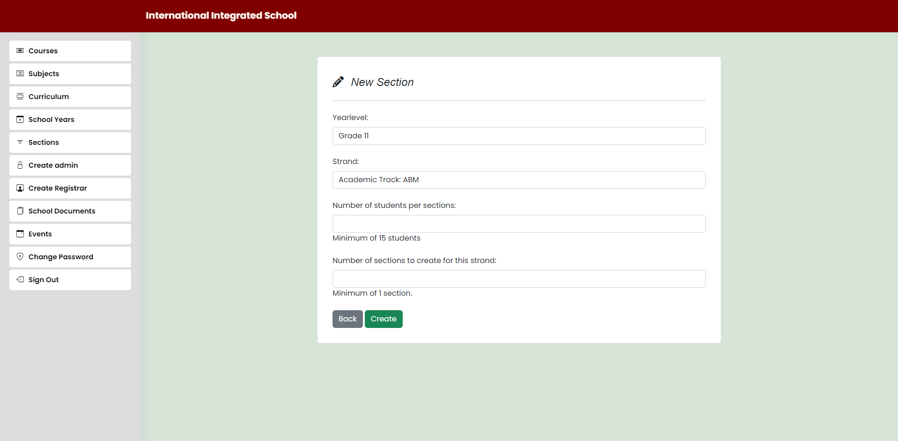

To add new section, fill all fields. On submit, the program will automatically create new section for the selected year level and strand. The program will also generate new schedule for every new section.

### Generate Section Schedule

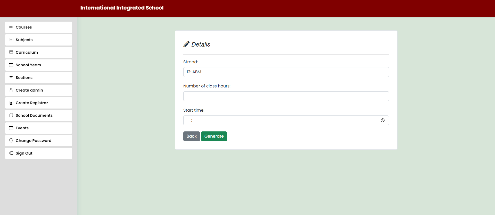

This page is used to generate new schedule for a year level with same course. E.g. Grade 12 ABM.

 

## Subjects

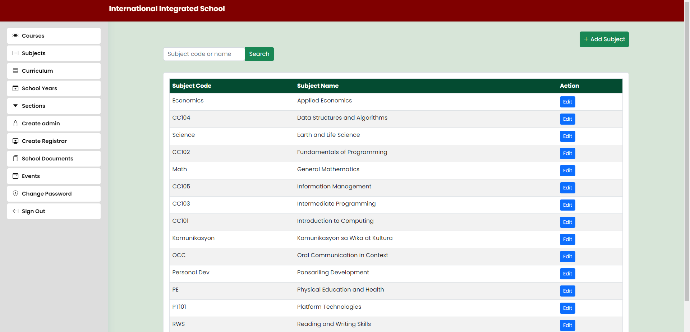

### Search Subject

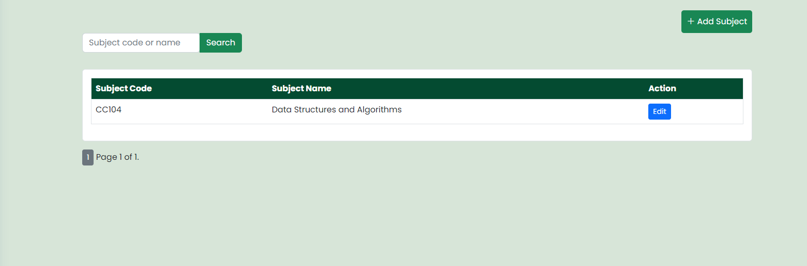

Search subject by **Subject Code** or **Subject Name**. The program will perform a case-insensitive search.

 

# Student Interface

 

## Class

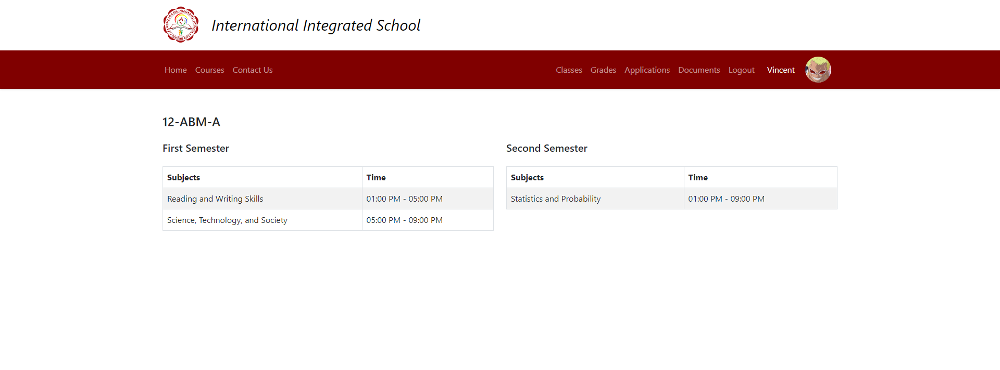

Display all class schedule of the student.

 

## Applications

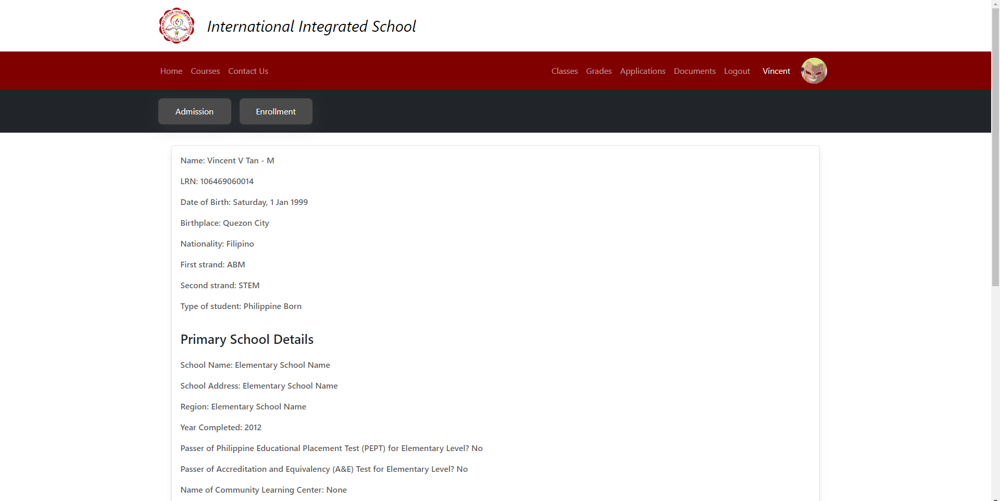

Show all submitted details of the student in **Admission** and **Enrollment**.

 

## Documents

List of all requested documents to the school.

 

## Documents - Request

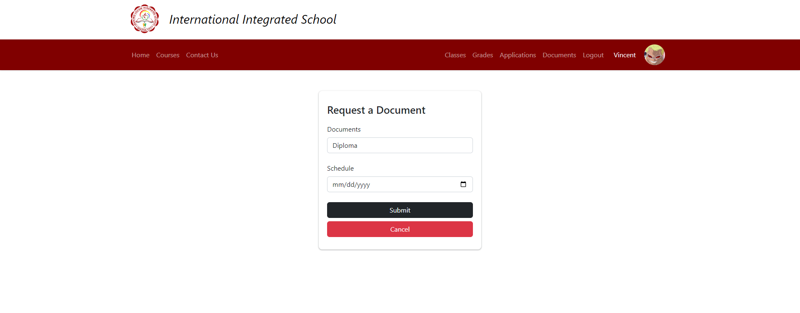

Form used to request a school document.

 

## Student Profile

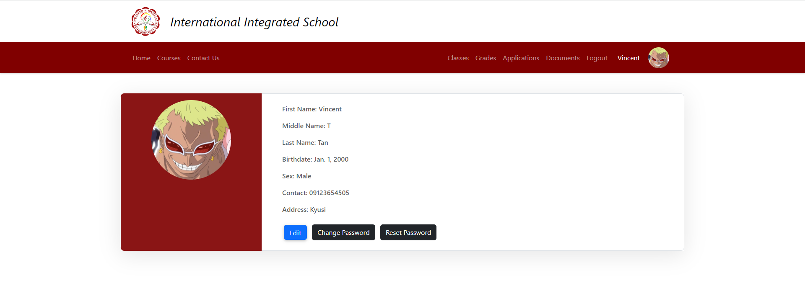

 

## Student Profile - Details and Edit

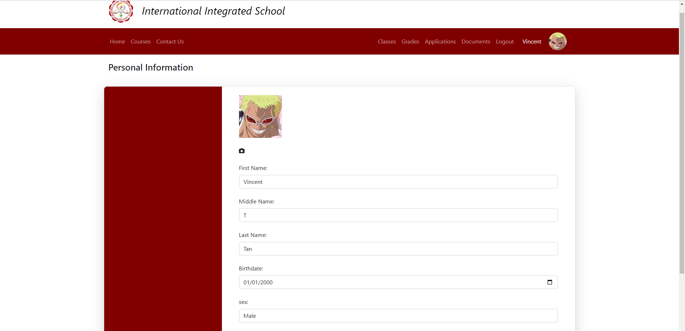

This page can update the details of the student account.

 
